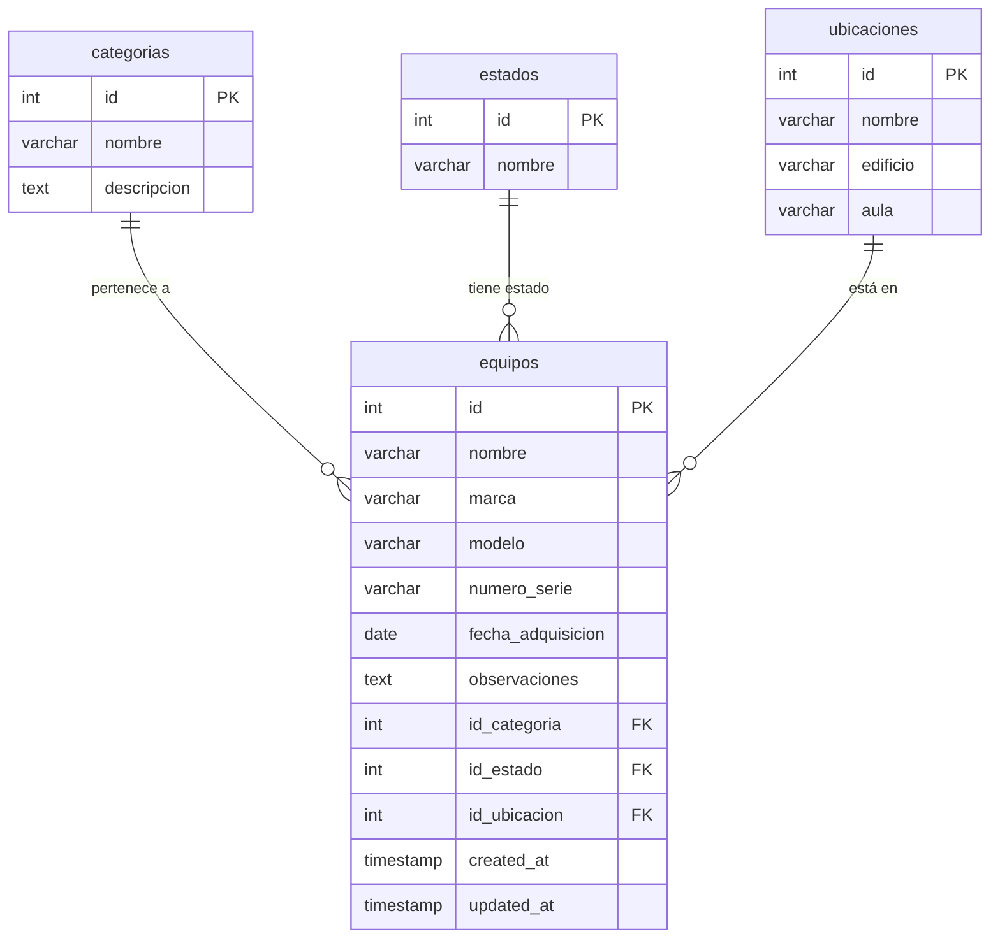

# Inventario de Cómputo

Sistema web para la administración del inventario de equipos de cómputo. CRUD completo con registro, edición, eliminación y consulta de equipos, categorizados por tipo, estado y ubicación física.

Desarrollado como proyecto final de la **Unidad 3 — Desarrollo Web** en la **Universidad de la Costa (CUC)**, Barranquilla, Colombia.

## Stack


## Funcionalidades

- CRUD completo de equipos de cómputo (crear, leer, actualizar, eliminar)
- Clasificación por **categorías** (Desktop, Portátil, Monitor, Impresora, Periférico)
- Seguimiento de **estado** (Disponible, En uso, En mantenimiento, Dado de baja)
- Asignación a **ubicaciones** (laboratorios, oficinas, almacén)
- Tabla responsiva con búsqueda visual
- Validación de formularios en frontend y backend
- Base de datos relacional con claves foráneas e integridad referencial
- Despliegue con Docker Compose (listo para producción)

## Captura


## Cómo se construyó

### Arquitectura

```
Cliente (React + Vite)  →  API REST (Express + Node)  →  MySQL 8.4
```

La aplicación sigue una arquitectura de tres capas:

| Capa | Tecnología | Descripción |
|------|-----------|-------------|
| Frontend | React 19 + Vite + Tailwind CSS v4 | Interfaz de usuario SPA, diseño responsivo con utilidades Tailwind |
| Backend | Node.js + Express 4 + mysql2 | API REST estructurada en controladores y rutas |
| Datos | MySQL 8.4 | Base de datos relacional con 4 tablas y FK |

### Decisiones técnicas

- **mysql2 con Pool de conexiones:** conexiones reutilizables con charset `utf8mb4` para soporte completo de acentos y caracteres especiales
- **Vite proxy:** en desarrollo, el frontend redirige `/api` a `localhost:4000` para evitar CORS
- **Nginx proxy reverso:** en producción (Docker), Nginx sirve el build de React y redirige `/api` al backend
- **node --watch** (v22+): recarga automática del servidor en desarrollo sin nodemon
- **Fechas nulas:** se convierten a `null` antes de enviar a MySQL para evitar errores SQL
- **Estado controlado en formularios:** se inicializa mediante `key` prop para evitar llamadas a setState dentro de efectos

### ¿Por qué estas tecnologías?

- **Express** → minimalista, maduro, ampliamente usado en APIs REST
- **React** → componente-based, ideal para interfaces dinámicas
- **Tailwind CSS** → utilidades directas en HTML, sin archivos CSS separados, facilita el diseño responsivo
- **MySQL** → base de datos relacional ampliamente usada en entornos educativos y empresariales
- **Docker** → elimina la dependencia de instalar MySQL y Node en la máquina anfitriona

## Despliegue con Docker (recomendado)

### Requisitos

- [Docker](https://docs.docker.com/get-docker/) (incluye Docker Compose)

### Pasos

```bash
# 1. Clonar el repositorio
git clone https://github.com/Jerzygroxx/Inventario_Computo.git
cd Inventario_Computo

# 2. Iniciar todos los servicios
docker-compose up --build
```

Esto levanta tres contenedores:

| Servicio | Puerto host | Descripción |
|----------|-------------|-------------|
| `db` | 3307 | MySQL 8.4 con esquema y datos de ejemplo |
| `backend` | 4000 | API REST de Express |
| `frontend` | 5173 | Nginx sirviendo el build de React |

La base de datos se inicializa automáticamente con tablas, relaciones y 10 equipos de ejemplo.

### Abrir en el navegador

```
http://localhost:5173
```

### Conexión directa a MySQL (opcional)

```bash
mysql -h localhost -P 3307 -u root -pinventario2024
```

### Detener servicios

```bash
docker-compose down
```

Para eliminar también los datos de la base de datos:

```bash
docker-compose down -v
```

## Desarrollo local (sin Docker)

### Requisitos

- Node.js 22+
- MySQL 8.4 corriendo

### Pasos

```bash
# Backend
cd backend
cp .env.example .env   # Editar credenciales según tu MySQL
npm install
npm run dev            # Inicia en :4000 con recarga automática

# Frontend (en otra terminal)
cd frontend
npm install
npm run dev            # Inicia en :5173, proxy a :4000
```

### Base de datos

```bash
mysql -u root -p < backend/database/schema.sql
mysql -u root -p < backend/database/seed.sql
```

## API REST

| Método | Endpoint | Descripción |
|--------|----------|-------------|
| GET | `/api/equipos` | Listar todos los equipos |
| GET | `/api/equipos/:id` | Obtener un equipo por ID |
| POST | `/api/equipos` | Crear un nuevo equipo |
| PUT | `/api/equipos/:id` | Actualizar un equipo |
| DELETE | `/api/equipos/:id` | Eliminar un equipo |
| GET | `/api/categorias` | Listar categorías |
| GET | `/api/estados` | Listar estados |
| GET | `/api/ubicaciones` | Listar ubicaciones |

### Ejemplo de creación (POST /api/equipos)

```json
{
  "nombre": "Desktop Dell Optiplex",
  "marca": "Dell",
  "modelo": "Optiplex 3090",
  "numero_serie": "SN-001",
  "fecha_adquisicion": "2024-01-15",
  "observaciones": "Torre completa",
  "id_categoria": 1,
  "id_estado": 2,
  "id_ubicacion": 1
}
```

## Modelo de datos



## Estructura del proyecto

```
inventario-computo/
├── docker-compose.yml          # Orquestación de contenedores
├── README.md
├── backend/
│   ├── Dockerfile
│   ├── .env.example
│   ├── package.json
│   ├── database/
│   │   ├── schema.sql          # Creación de BD y tablas
│   │   └── seed.sql            # Datos de ejemplo (5 categorías, 4 estados, 5 ubicaciones, 10 equipos)
│   └── src/
│       ├── app.js              # Punto de entrada Express
│       ├── config/db.js        # Pool de MySQL con utf8mb4
│       ├── controllers/        # Lógica de negocio por recurso
│       ├── routes/             # Definición de rutas REST
│       └── middlewares/        # Manejador global de errores
├── frontend/
│   ├── Dockerfile              # Multi-etapa (build → Nginx)
│   ├── nginx.conf              # Proxy reverso para producción
│   ├── vite.config.js          # Plugin React + Tailwind + proxy
│   ├── package.json
│   └── src/
│       ├── main.jsx            # Entry point React
│       ├── App.jsx             # Layout principal
│       ├── index.css           # Import de Tailwind
│       ├── components/         # Navbar, EquipoForm
│       ├── pages/              # EquiposPage (CRUD completo)
│       └── services/           # Cliente fetch modular
└── docs/
    └── Documento_Explicativo_Inventario_Computo.docx
```

## Variables de entorno

### Backend (.env)

| Variable | Valor por defecto | Descripción |
|----------|------------------|-------------|
| `DB_HOST` | localhost | Host de MySQL |
| `DB_PORT` | 3306 | Puerto de MySQL |
| `DB_USER` | root | Usuario de MySQL |
| `DB_PASSWORD` | (vacío) | Contraseña de MySQL |
| `DB_NAME` | inventario_computo | Nombre de la base de datos |
| `PORT` | 4000 | Puerto del servidor Express |

## Licencia

Este proyecto fue desarrollado con fines académicos.

## Autor

**Jorge** — Estudiante de Ingeniería de Sistemas  
Universidad de la Costa (CUC), Barranquilla, Colombia
